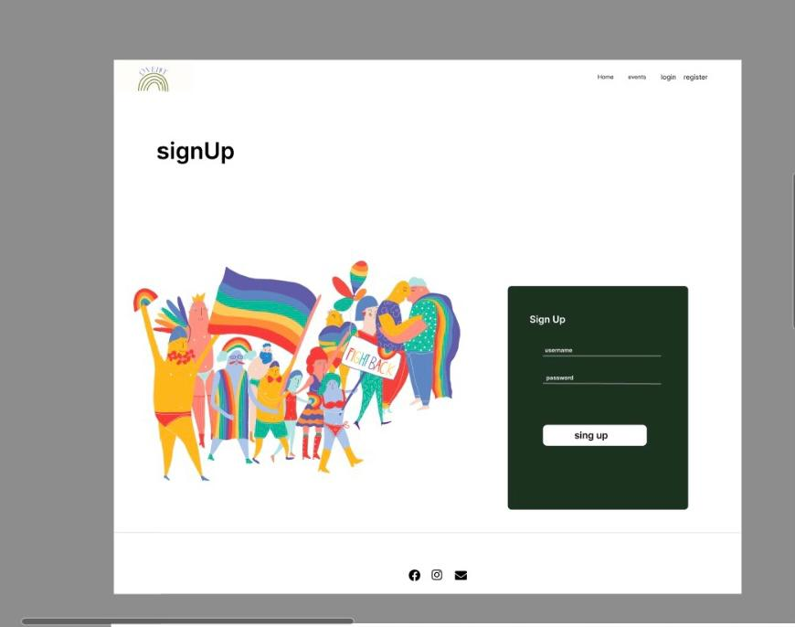
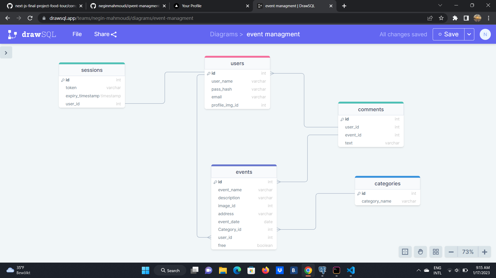

# Qvent

## Description

qvent is a full stack web application which help people/ organizations to host and follow events in a more organized yet simpler way.
To create events you need to register with the site. You can also leave comments

## Functionalities

- Landing page
- Events page where all the events are listed with the ability of filtering them by category
- Full user authentication process (registration and login)
- User authorisation incl. creation of session tokens
- Dynamic routing for each event details page with the ability of leaving comments
- Private profile page where registered people can edit or delete their events information
- The header adapts based on screen size and status of the user (logged in / not logged in)

## Technologies

- Next.js
- React
- Postgres
- Emotion
- Node.js
- Figma
- DrawSQL
- Jest unit tests
- Playwright E2E tests
- Typescript
- REST API
- Cloudinary

## Setup instructions

- Clone the repository with `git clone <repo>`
- Setup the database by downloading and installing PostgreSQL
- Create a user and a database
- Create a new file .env
- Create an API key on the Google Maps Platform and store it in your .env with a variable name starting with NEXT*PUBLIC*
- Copy the environment variables from .env-example into .env
- Replace the placeholders ######### with your username, password and name of database
- Install dotenv-cli with `yarn add dotenv-cli`
- Run `yarn install` in your command line
- Run the migrations with `yarn migrate up`
- Start the server by running `yarn dev`

## Deploy on fly.io

- Generate a Fly.io Token, called _GitHub Actions Deploy Token_ and copy the text
- Create a new repository secret in the GitHub repo, named FLY_API_TOKEN
- Log into Fly.io on the command line: `flyctl auth login`
- Create an app `flyctl apps create --name <app name>`
- Create the Fly.io config files
- Add database credentials using Fly.io secrets
  `flyctl secrets set PGHOST=localhost PGDATABASE=$(openssl rand -hex 16) PGUSERNAME=upleveled$(openssl rand -hex 16) PGPASSWORD=$(openssl rand -base64 32)`
- Add built time environment variables to the config files (fly.toml, Dockerfile) as described [here](https://fly.io/docs/languages-and-frameworks/nextjs/#what-about-build-time-environment-variables)
- Create a 1GB volume for the PostgreSQL database in Frankfurt
  `flyctl volumes create postgres --size 1 --region fra`
- Deploy: `flyctl deploy`

## Images

** this a student project and it has no commercial benefits**
credits : Image by (alicia_mb), rawpixel.com, Pinterest( Ceci Morales)

## Screenshots

